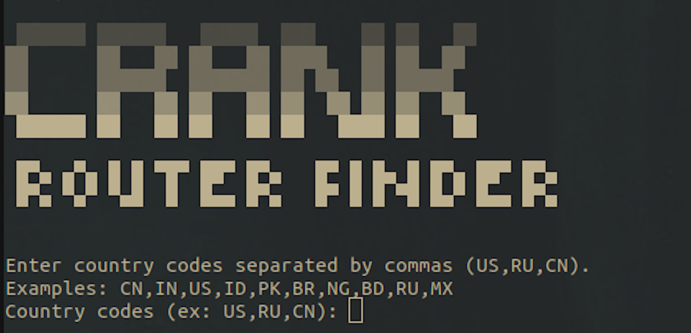
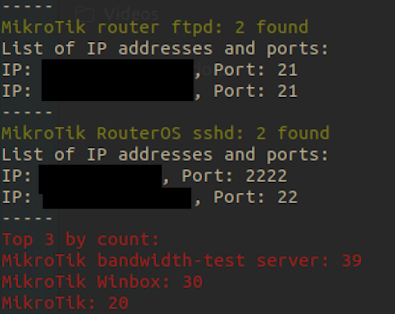
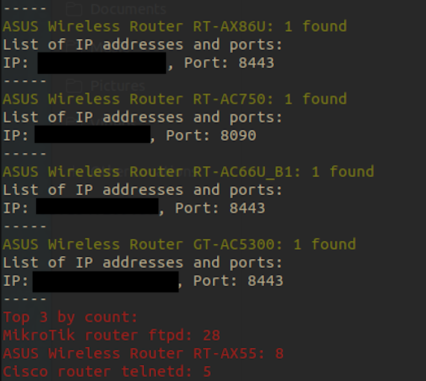

# CRANK-ShodanRouterFinder
The goal of this project was to efficiently find router brands, models, ip addresses, and open ports by country. 
I think you need to pay $49 for Shodan to get an API key, but that's it.
**Use this wisely...**





# Directions
```
1. add shodan API key to script
2. python3.8 crank.py   #That's it!
```
