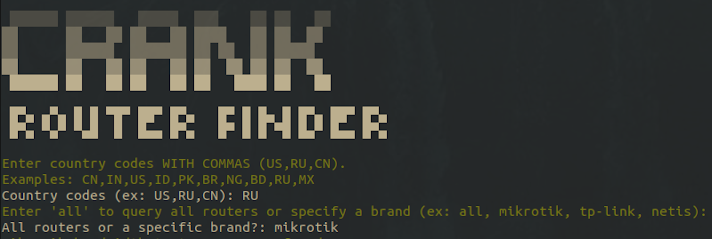
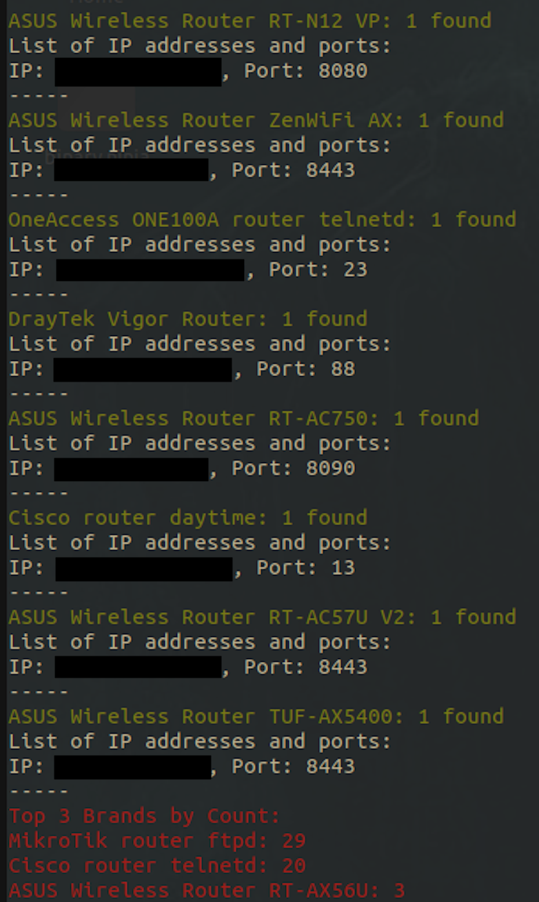

# CRANK - Shodan Router Finder
GOAL: To efficiently and visually see what router brands and models exist in specific numbers on average in a country
based off Shodan.io. All you need is your API key, so I think you need to pay for Shodan. 




# Directions
```
python3.8 crank.py  # That's it
```

